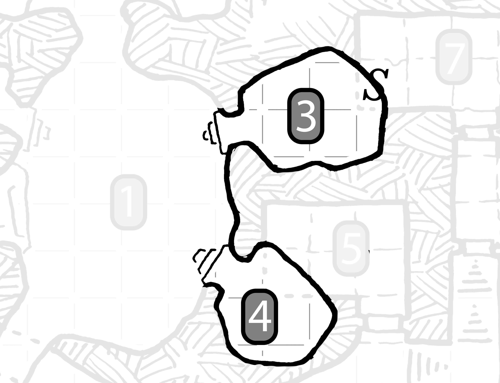

<link href="style.css" rel="stylesheet"></link> 

<body>

# Is Mightier

## An Adventure for [Cairn](https://yochaigal.itch.io/cairn)
### Cartography by [Dyson Logos](https://dysonlogos.blog/) / Art by [Perplexing Ruins](https://www.perplexingruins.com/)

  *"I was a mapmaker and well-regarded, travelling distant lands recording the world for nobles, universities, warlords. My craft was my joy. Once I found [the Quill](#the-quill) everything changed. I craved power and sought strange magic to sate my hunger to create. Eventually I realized this need was not mine but the Quill's. It drove me like a beast of burden. When I could longer please it, it trapped me [here](#8-inner-sanctum)."*

  ### Adventure Hooks
  * A merchant has been waiting on the completion of an [atlas](#8-inner-sanctum) of trade routes for months. They will hire you to retrieve the atlas from the Cartographer's lair. 
  * The grand vizier of a local noble has heard rumors that the Cartographer employs a [magic quill](#8-inner-sanctum) to create such remarkable maps. They offer you a small fortune to steal it, by any means necessary. 
  * A glass maker is trying to mount an expedition to the fabled Forgotten Observatory. They will pay well for a [map](#8-inner-sanctum) to the mysterious location. 

---

<section class="location">

### :warning: Loud noise in this area will attract [Mountain Birds](#mountain-bird) from the [Nest](#2-nest).

## 0 Entrance
* 15’ wide slab of rock extends from a cave opening.  
* Covered in bird droppings.
* Sturdy, weather beaten chair slammed into a crevice. 
  * Hidden underneath - small wooden case containing the **Telescopic Eye.**

<aside class="item">

### Telescopic Eye, 1 charge 
Handheld telescope with a [**Preserved Eye**](#5-living-quarters) stuck in the opening. Looking through casts the **Arcane Eye** spell ([Cairn](https://yochaigal.itch.io/cairn), pg 16) and the **Preserved Eye** crumbles to dust. Acts as a normal telescope when out of charges. 

**Recharge**: place a [**Preserved Eye**](#5-living-quarters) in the opening.
</aside>

## 1 Drafting Room
* Faint breeze blows through the wind-smooth stone chamber.
* 20' long drafting table, deep claw gouges along the top. 
* Scraps of torn maps everywhere - piled in the corners, lazily drifting in the air.
* **Hazard**: The tunnel in far wall slopes downward towards a 50' drop - wet and very slippery.
  * **DEX save or slip down the tunnel.**
  * **STR save to catch the edge before falling.**
* **Hazard**: Every few minutes a *strong wind* roars through the chamber.
  *  **DEX save or be caught in a parchment whirlwind, d6 damage.**
  *  **STR save or be pushed d20+10' towards the tunnel.**

                                     
</section>

<section class="location">

## 2 Nest

   

* **d4 Mountain Birds** roost in a nest shredded parchment.
* **Secret door**: Refuse in the corner conceals a hidden bird graveyard. 
  * Mountain Bird skeletons arranged neatly.
  * Piles of shiny objects sit in front of each.
    * d66 gp in small coin, gems and trinkets.

<aside class="monster">

## Mountain Bird
### Human-sized birds, territorial, sentimental 
10 HP, 12 STR, 12 DEX, 6 WIL, claw and peck (d6)
* Aggressive towards intruders.
* Soothed by food and shiny trinkets.
* Critical Damage - steal a shiny trinket from the target.
</aside>

</section>

<section class="location">

 

## 3 Ink Storage
* 5 barrels of ichorous black ink.
  * Hidden runes on the underside of the barrels infuses the ink with magical energy creating the [**Ink Ooze**](#7-storeroom), which will continually regenerate until the barrels are destroyed. 
  * Close inspection reveals ink is dripping through the floor.
  * **Secret door**: Significant damage to the floor will open a passage into the [**Storeroom**](#7-storeroom).
    * [**Ink Ooze**](#7-storeroom) will grow through the passage if opened.

## 4 Parchment Storage
* Dozens of cubbies line the wall full of blank rolls of parchment. 
* Half finished map, covered in inky smudges sits on the floor next to a small keg of **Cleaning Spirit**. 
<aside class="item">

### Cleaning spirit, 6 uses
Pure alcohol, immaculately distilled. Powerful ink solvent. Useful as a weapon against ink-based creatures. 
* 1 use - d8 DMG
* 2 uses - d12 DMG, blast
  
</aside>

</section>

<section class="location">

## 5 Living Quarters 
### :warning: Loud noise in this area will attract [Living Sketches](#6-study) from the [Study](#6-study).
* Long descending passage, transitions from rough hewn tunnel to masonry block walls. 
  * *"Through me, creation"* written on the wall, glowing like metal in a forge.
* Door has been broken from the inside, debris is scattered around the hallway. 
* An inky drawing of a door fills the doorframe. It functions as a normal door although it is clearly a drawing.
* Touching the door leaves black smudges on hands.
* Inside is a modest bed chamber in disarray - clothes and furniture haphazardly spread around the room. 
  * Hidden under the bed - chest containing the **Wand of Wind** and **d4 Preserved Eyes**

<aside class="item">

### Wand of Wind, 4 charges 
* 1 charge - calm a strong wind OR produce a strong wind **anywhere the wind normally blows**
* 2 charges - produce a strong wind **in places the wind does not blow**

**Recharge**: lose grip of the wand in naturally occurring wind. If found it will be recharged.
</aside>

</section>

<section class="location">

## 6 Study
* Fine rug, leather sofa, book case
  * Tucked away - **Scroll of True Sight** ([Cairn](https://yochaigal.itch.io/cairn), pg 18) 
* *"I am the tool that none can wield"* burned into the rug.
* **d4 Living Sketches** guard the room 

<aside class="monster">

## Living Sketch
### Animated drawing made of eldritch ink
6 HP, 6 STR, 12 DEX, 2 WIL, *see below for attack*
*  mindless goon created by the Quill
*  fights to the death 
*  roll to determine appearance and attack
*  Critical Damage - wound leaves a permanent inky scar
  
| d6 | appearance | attack |
|----|----|----|
| 1 | vaguely canine form | bite (d6)
| 2 | abstract mountain landscape | landslide (d12)
| 3 | portrait of an oaf | punch & belch (d4), stinks
| 4 | still life with flowers | vase smash (d6)
| 5 | scene from a bullfight | gore (d10), DEX save or lose your next turn
| 6 | detailed architectural rendering | bell tower slam (d10), STR save or deafened for d4 rounds

</aside>

## 7 Storeroom 
* Dried foodstuffs, ale, lard, rope, candles.
* 10' foot puddle of **Ink Ooze** seeps from a crack in the wall.
* **Secret door**: Significant damage to the wall will open a passage into [**Ink Storage**](#3-ink-storage).

<aside class="monster">

## Ink Ooze
### Ichorous pulsating ink blob, it keeps growing 
14 HP, 2 Armor, 12 STR, 4 DEX, 2 WIL, *see below*
* Each turn take 1 action:
  * Grow 5 feet in all directions.
  * slam all PCs in range (d6 blast).
  * Recover d6 HP or d4 STR.
* Sticky - STR save to remove anything that pierces the Ooze. 
* Contact with [**cleaning spirit**](#4-parchment-storage) and other high proof alcohol causes the Ooze to shrink 5 feet in all directions and prevents HP/STR recovery for 1 round. 
* Will continue to regenerate until the barrels in [**Ink Storage**](#3-ink-storage) are destroyed.
</aside> 

</section>

<section class="location">

## 8 Inner Sanctum

   

* 25' vaulted ceiling.
  * [**The Quill**](#the-quill) floats high above, concealed by the dark.
* Stone dais and lectern, dimly lit by 3 three candles.
* Shelves along the north wall, full of maps.
  *  Trail through Windy Pass to the Forgotten Observatory, 75 gp.
  *  Atlas of Northern Counties and Trade Routes, *heavy*, 350 gp.
  *  d4 selections from [the Great Cartographer](https://dysonlogos.blog/maps/commercial-maps/), 50 pg each.
  *  *Any map or document needed to introduce an adventure.*

* 3  closets with false backs concealing hidden rooms.
  1.  Fine robes, red and black velvet with jewel adornments, 100 gp.
       * **Secret door**: Decades of hand written business records. 
  2.  Extra bedclothes.
       * **Secret door**: Shrine to lesser god, defaced by glowing, profane doodles.
  3.  Empty closet.
      * **Secret door**: The Cartographer in an ornately sketched birdcage, which behaves as an **Astral Prison** ([Cairn](https://yochaigal.gumroad.com/l/cairnrpg), pg 16). If freed, the Cartographer will tell their story, explaining how the Quill drove them to strange magic to enchance their creative ability. They will freely offer any magical goods taken from the lair as payment for rescuing them. *"I need a break from magic."*
   
--- 

<aside class="monster">

## The Quill
### Malicious personification of creativity, riotously colored feather, vicious tip
30 HP, 2 STR, 15 DEX, 15 WIL, stab (d8)
* Is Mightier - immune to damage from bladed weapons
* Sneak Attack - double damage if target is unaware.
* Quick Flight - travel up to 60ft in a single movement.
* Sketch back up - create a [**Living Sketch**](#living-sketch).
* Critical Damage - penetrates through the target, leaves a permanent inky scar.
* If facing mortal danger, retreats to safe location to sketch back up. 
* **At 0 HP, the Quill falls dormant.** 
  * If used to write - WIL save to retain control or the Quill returns to full HP and escapes.

</aside>

</section>
</body>
